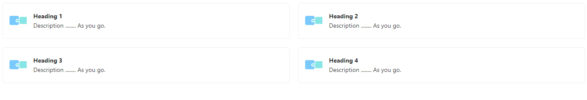

# CSS-Tricks
CSS tricks and Short cuts to make big changes in UI 

## Display divs in grid format with responsive easily with below css script 

``` javascript
    row-gap: 20px;
    column-gap: 20px;
    grid-template-columns: 1fr 1fr;
    display: grid;
    
    
```
HTML & CSS Code snippet:

``` javascript
<!DOCTYPE html>
<html lang="en">
  <head>
    <style>
      .link-list {
        row-gap: 20px;
        column-gap: 20px;
        grid-template-columns: 1fr 1fr;
        display: grid;
        font-family: "Nunito Sans", -apple-system, ".SFNSText-Regular",
          "San Francisco", BlinkMacSystemFont, "Segoe UI", "Helvetica Neue",
          Helvetica, Arial, sans-serif;
      }
      .link-item img {
        height: 40px;
        width: 40px;
        margin-right: 15px;
        flex: none;
      }
      .link-item {
        display: block;
        padding: 20px 30px 20px 15px;
        border: 1px solid #00000010;
        border-radius: 5px;
        transition: background 150ms ease-out, border 150ms ease-out,
          transform 150ms ease-out;
        color: #333333;
        display: flex;
        align-items: flex-start;
        text-decoration: none;
      }

      .link-item span {
        font-size: 14px;
        line-height: 20px;
      }

      .link-item strong {
        font-weight: 700;
        display: block;
        margin-bottom: 2px;
      }
      .link-item span {
        font-size: 14px;
        line-height: 20px;
      }
    </style>
  </head>
  <body>
    <div class="link-list">
      <a href="#" target="_blank" class="-a link-item">
        
        <span class="-span css-2ltd27">
          <strong>Heading 1</strong> Description ........ As you go.
        </span>
      </a>
      <a href="#" target="_blank" class="link-item">
        
        <span class="">
          <strong>Heading 2</strong> Description ........ As you go.
        </span>
      </a>
      <a href="#" target="_blank" class="link-item">
        
        <span class="">
          <strong>Heading 3</strong> Description ........ As you go.
        </span>
      </a>
      <a href="#" target="_blank" class="link-item">
        
        <span class="">
          <strong>Heading 4</strong> Description ........ As you go.
        </span>
      </a>
    </div>
  </body>
</html>

``` 
